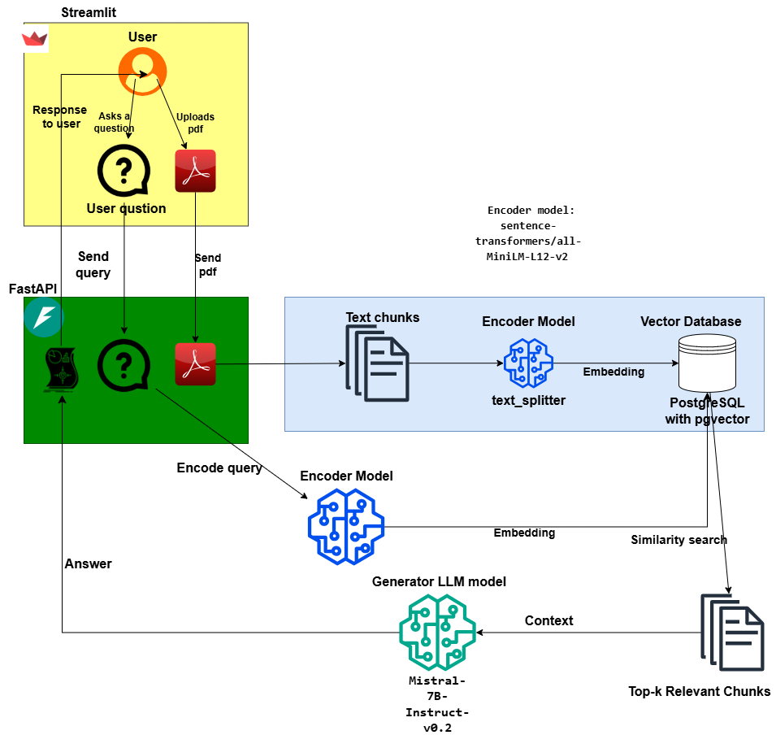

#### Overview
This project is a **document-aware chatbot application** that combines **Streamlit** as the frontend and **FastAPI** as the backend. It utilizes **Retrieval-Augmented Generation (RAG)** to allow users to upload PDF files and ask questions based on the content of the document. The chatbot employs the following components:
- LLM: `Mistral-7B-Instruct-v0.2` for generating contextual responses.
- Encoder: `sentence-transformers/all-MiniLM-L12-v2` for embedding document content.
- Database: PostgreSQL with the **pgvector** extension to enable efficient vector-based storage and retrieval.

---

## Features
1. **Document Upload**: Users can upload PDF files for contextual question answering.
2. **Contextual Chatbot**: The chatbot uses RAG to provide accurate responses based on uploaded documents.
3. **Streamlit Frontend**: An intuitive interface for file upload and interacting with the chatbot.
4. **FastAPI Backend**: Manages requests, processes embeddings, and interacts with the database.
5. **Efficient Vector Search**: Embeddings of the document content are stored and retrieved using **pgvector** in PostgreSQL.
6. **Pretrained Models**: Incorporates cutting-edge LLM and encoder models for natural language understanding and response generation.
7. **Dockerized Deployment**: The project is containerized using Docker for easy setup and deployment.

## Project Structure Diagram
The following diagram illustrates the architecture and flow of the project:



## Prerequisites
Ensure the following tools are installed:
1. [Docker](https://www.docker.com/get-started)
2. [Docker Compose](https://docs.docker.com/compose/install/)

---

## Getting Started

### Clone the Repository
```bash
git clone https://github.com/your-username/your-repository.git
cd your-repository
```

### Add `.env` File
1. Create a `.env` file in the root directory of the project and add:

```plaintext
HUGGINGFACEHUB_API_TOKEN=<your_huggingface_token>
POSTGRES_PASS=<your_postgres_password>
POSTGRES_USER=your_postgres_username
POSTGRES_PASSWORD=your_postgres_password
POSTGRES_DB=your_database_name
DB_HOST=postgres_db
DB_PORT=5432
LLM_model_id="mistralai/Mistral-7B-Instruct-v0.2"
model_encoder="sentence-transformers/all-MiniLM-L12-v2"

UPLOAD_URL=http://fastapi:8000/uploadfile/
DELETE_URL=http://fastapi:8000/deletefile/
CHAT_URL=http://fastapi:8000/query
BACKEND_URL=http://fastapi:8000
DB_HOST=postgres
```

2. **`requirements.txt`**
   - If using GPU, use the following link:
     ```plaintext
     --extra-index-url https://download.pytorch.org/whl/cu118
     ```
   - If using CPU only, change to the following link:
     ```plaintext
     --extra-index-url https://download.pytorch.org/whl/cpu
     ```
   - Comment out the one that is not used.

3. **`model.py`**
   - If using CPU only, comment out the following in Class `ChatModel.__init__`:
     ```python
     quantization_config = BitsAndBytesConfig(load_in_4bit=True, bnb_4bit_compute_dtype=torch.bfloat16)
     ```
   - For `self.model = AutoModelForCausalLM.from_pretrained()` function, comment out:
     ```python
     quantization_config=quantization_config,
     ```

4. Ensure the `.env` file is included in your `.gitignore`.

---

### Run the Application with Docker Compose
1. **Build and Start Services:**
   Run the following command to build the Docker containers and start the services:
   ```bash
   docker-compose up --build
   ```

2. **Access the Streamlit App:**
   Once the containers are running, open your browser and go to:
   ```plaintext
   http://localhost:8501/
   ```

3. **Access FastAPI Docs (if applicable):**
   FastAPI endpoints are available at:
   ```plaintext
   http://localhost:8000/docs
   ```

---

## Stopping the Application
To stop the application and remove containers, networks, and volumes, run:
```bash
docker-compose down
```

---

## Troubleshooting

1. **Port Issues:**
   If ports `8501` or `8000` are already in use, update the `docker-compose.yml` file to change the ports.

2. **Database Connection:**
   Ensure the database credentials in the `.env` file match the configuration in `docker-compose.yml`.

3. **Check Logs:**
   View logs for specific services to debug issues:
   ```bash
   docker logs <container_name>
   ```

---

## Folder Structure
```plaintext
/
├── app  # This is the container WORKDIR
│   ├── uploaded_files  # Folder created by the app to store uploaded files from Streamlit
│   ├── .dockerignore
│   ├── .env 
│   ├── docker-compose.yml 
│   ├── Dockerfile.fastapi
│   ├── Dockerfile.postgres
│   ├── Dockerfile.streamlit
│   ├── requirements.txt
│   ├── model.py
│   ├── rag_util.py
│   ├── streamlit_app.py
│   ├── fastapi_app.py

├── models  # Cache for language and embedding models
│   ├── some_language_model
│   └── some_embedding_model
├── Miscellaneous
```

---

__*Essential whether GPU or CPU is available.__

__**Optional and might require further changes.__
